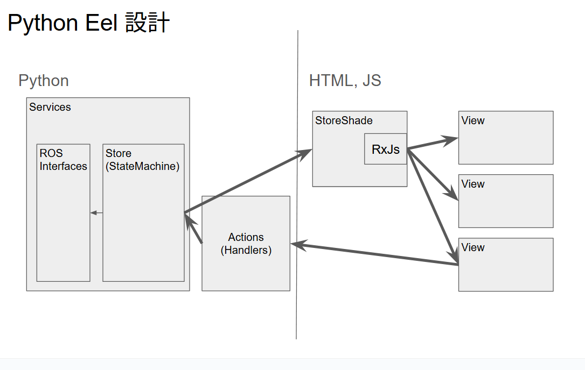

# Eel Example App

## Install
### Install Packages
```sh
poetry env use 3.8
poetry install
```

### Install Chronium
```sh
sudo apt install -y libgtk2.0-0 libgtk-3-0 libnotify-dev libgconf-2-4 libnss3 libxss1 libasound2 libxtst6 xauth xvfb libgbm-dev fonts-ipafont
```

## Structure
```
your_app/
├── main.py                   # アプリケーションのエントリーポイント
├── handlers/                 # @eel.exposeされた関数群
├── services/                 # サービス群
├── utils/                    # Pythonユーティリティ
├── templates/                # HTMLテンプレート
│   └── index.html            # エントリーポイント
|   └── components/           # コンポーネント群
|       └── header.html
├── dist/                     # 生成コード
│   └── web/
│       └── index.html
└── data/                     # 永続化データ
    └── state.json
```
