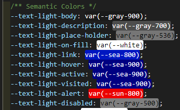

# デザインシステム

## カラーパレット
### メインカラー
```css
  --primary-color: rgb(199, 71, 0);
  --secondary-color: rgb(251, 91, 1);
  --tertiary-color: rgb(139, 50, 0);
```


### アクセントカラー
```css
  --accent-color: rgb(0, 123, 255);
```


### グレースケール
```
  --gray-50: #f2f2f2;
  --gray-100: #e6e6e6;
  --gray-200: #cccccc;
  --gray-300: #b3b3b3;
  --gray-400: #999999;
  --gray-420: #949494;
  --gray-500: #7f7f7f;
  --gray-536: #767676;
  --gray-600: #666666;
  --gray-700: #4d4d4d;
  --gray-800: #333333;
  --gray-900: #1a1a1a;
```


### テキストカラー
```css
  --text-light-body: var(--gray-900);
  --text-light-description: var(--gray-700);
  --text-light-place-holder: var(--gray-536);
  --text-light-on-fill: var(--white);
  --text-light-link: var(--sea-800);
  --text-light-hover: var(--sea-900);
  --text-light-active: var(--sea-900);
  --text-light-visited: var(--sea-900);
  --text-light-alert: var(--sun-800);
  --text-light-disabled: var(--gray-500);
```
